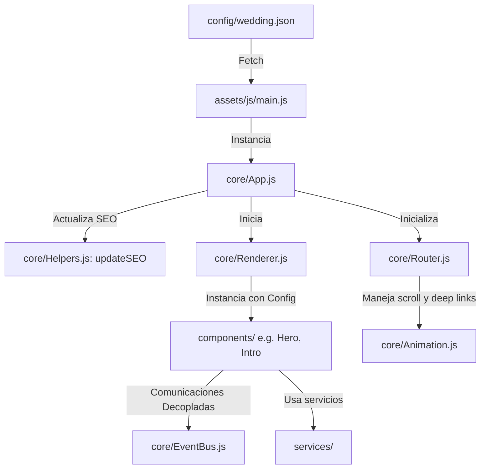

# Plan de Implementación Final: Plantilla Modular Balanceada para Invitaciones de Boda

Este plan consolida la arquitectura final del proyecto. Buscamos el equilibrio perfecto entre profesionalismo, modularidad y simplicidad, evitando la sobreingeniería y asegurando que el proyecto sea una plantilla 100% reutilizable.

---

## 1. Arquitectura Refinada del Proyecto

El flujo de ejecución de la aplicación y la estructura se simplifican de la siguiente manera:



### Estructura de Directorios

```
boda-web/
├── config/
│   └── wedding.json       # Único archivo de configuración (Pareja, textos, SEO, WhatsApp, colores)
├── core/
│   ├── App.js             # Clase App (exportada sin instanciar)
│   ├── Component.js       # Clase base abstracta de componentes
│   ├── Renderer.js        # Gestor de renderizado y ciclo de vida de componentes
│   ├── EventBus.js        # Canal de eventos desacoplado para comunicación entre componentes
│   ├── Router.js          # Router hash-based para anclas, scroll suave y deep linking
│   ├── Observer.js        # Utilidad IntersectionObserver para animaciones scroll
│   ├── Animation.js       # Utilidades de animación (scrollTo)
│   └── Helpers.js         # Utilidades comunes (formateadores, escape HTML, actualizador de SEO)
├── services/
│   ├── whatsapp.js        # Generador de enlaces dinámicos de WhatsApp
│   └── countdown.js       # Utilidades de tiempo para cuenta regresiva (pendiente de implementar)
├── plugins/               # Carpeta para futuras extensiones (música, pétalos, analíticas)
├── theme/
│   ├── colors.css         # Paleta de colores oficiales
│   ├── typography.css     # Fuentes tipográficas y jerarquías
│   ├── spacing.css        # Márgenes, rellenos y límites de contenedores
│   ├── shadows.css        # Elevaciones y sombras
│   └── animations.css     # Animaciones globales y control de prefers-reduced-motion
├── components/
│   ├── Hero/
│   │   ├── index.js       # Clase Hero
│   │   └── styles.css     # Estilos de Hero
│   └── Intro/
│       ├── index.js       # Clase Intro
│       └── styles.css     # Estilos de Intro
├── assets/
│   ├── css/
│   │   └── styles.css     # Archivo central de estilos (importa theme y componentes)
│   ├── js/
│   │   └── main.js        # Instanciador e inicializador de la App
│   ├── fonts/             # Tipografías locales (si aplica en el futuro)
│   ├── lottie/            # Animaciones vectoriales Lottie (vacía inicialmente)
│   ├── img/
│   │   ├── hero/          # Recursos del Hero
│   │   ├── gallery/       # Recursos de la Galería
│   │   ├── decorations/   # Elementos gráficos y separadores
│   │   ├── flowers/       # Recursos botánicos
│   │   └── icons/         # Iconos de la interfaz
│   ├── audio/             # Archivos de sonido
│   └── video/             # Archivos de video
├── manifest.json          # Estructura del Web App Manifest (listo para PWA)
├── index.html             # Estructura inicial y contenedor #app
├── README.md
├── CONTEXTO.md
├── DECISIONES.md
├── INSTRUCCIONES.md
└── PROGRESO.md
```

---

## 2. Definición Detallada de Archivos

### A. Configuración Unificada (JSON)

#### [NEW] [wedding.json](file:///c:/Users/reyda/OneDrive/Documentos/Invitación/boda-web/config/wedding.json)
Consolida todos los datos del evento, textos, configuraciones y SEO.
```json
{
  "event": {
    "bride": "Angélica",
    "groom": "Daniel",
    "date": "2026-11-27",
    "location": {
      "name": "Casa Lu",
      "address": "Puerto Morelos, Cancún",
      "googleMapsUrl": "https://maps.app.goo.gl/fnfWZoRzMWCpLbqu9"
    }
  },
  "whatsapp": {
    "phone": "+522413273836",
    "defaultMessage": "¡Hola! Confirmo mi asistencia a la boda de Angélica y Daniel."
  },
  "seo": {
    "title": "Boda de Angélica & Daniel",
    "description": "Acompáñanos a celebrar nuestra unión matrimonial el 27 de noviembre de 2026 en Puerto Morelos, Cancún.",
    "ogTitle": "Boda de Angélica & Daniel",
    "ogDescription": "Invitación digital oficial para nuestra boda",
    "ogImage": "assets/img/hero/im1.jpg",
    "ogUrl": "https://gilberto-rv.github.io/Invitacion-Boda/",
    "canonical": "https://gilberto-rv.github.io/Invitacion-Boda/",
    "twitterCard": "summary_large_image"
  },
  "texts": {
    "hero": {
      "subtitle": "¡Nos casamos!"
    },
    "intro": {
      "title": "Nuestra Historia",
      "body": "Ante las adversidades siempre prevaleció nuestro amor.\n\nHoy comprendemos que cada desafío fue una prueba que fortaleció nuestro vínculo y convirtió nuestro amor en una promesa firme.\n\nCon enorme ilusión iniciamos una nueva etapa en nuestras vidas, deseando compartir este momento tan especial con quienes más queremos."
    },
    "common": {
      "scrollDown": "Desliza para ver más"
    }
  },
  "people": {
    "parents": {
      "bride": ["Imelda Cruz Montiel", "Pedro Vázquez Paredes"],
      "groom": ["Esperanza Corona Ordoñez"]
    },
    "sponsors": {
      "velacion": ["Carlos Mayllen Corona"],
      "lazoBiblia": ["Adriana Azucena Mancebo Suárez", "Alejandro Sandoval Fierro"],
      "anillos": ["Ma. Guadalupe Saldaña Zamora"],
      "arras": ["Verla Lucía Cruz Sánchez", "José David Vásquez Cruz"]
    }
  },
  "assets": {
    "heroBg": "assets/img/hero/im1.jpg",
    "introBg": "assets/img/gallery/im2.jpg"
  }
}
```

---

### B. Capa Core (Lógica Compartida)

#### [NEW] [Component.js](file:///c:/Users/reyda/OneDrive/Documentos/Invitación/boda-web/core/Component.js)
```javascript
export default class Component {
  constructor(config) {
    if (this.constructor === Component) {
      throw new TypeError("No se puede instanciar la clase abstracta Component directamente.");
    }
    this.config = config;
  }

  render() {
    return '';
  }

  init() {
    // Sobrescribir en subclases
  }
}
```

#### [NEW] [Renderer.js](file:///c:/Users/reyda/OneDrive/Documentos/Invitación/boda-web/core/Renderer.js)
```javascript
export default class Renderer {
  constructor(config) {
    this.config = config;
    this.instances = [];
  }

  render(componentClasses, selector) {
    const container = document.querySelector(selector);
    if (!container) {
      console.error(`Contenedor '${selector}' no encontrado.`);
      return;
    }

    this.instances = componentClasses.map(({ Class }) => new Class(this.config));
    container.innerHTML = this.instances.map(instance => instance.render()).join('');

    this.instances.forEach(instance => {
      if (typeof instance.init === 'function') {
        try {
          instance.init();
        } catch (error) {
          console.error(`Error en ciclo de vida init del componente:`, error);
        }
      }
    });
  }
}
```

#### [NEW] [App.js](file:///c:/Users/reyda/OneDrive/Documentos/Invitación/boda-web/core/App.js)
Clase exportada sin instanciar para evitar patrones singleton restrictivos globales.
```javascript
import Renderer from './Renderer.js';
import Router from './Router.js';
import { updateSEO } from './Helpers.js';

export default class App {
  constructor() {
    this.components = [];
    this.config = {};
    this.router = null;
  }

  registerComponent(name, ComponentClass) {
    this.components.push({ name, Class: ComponentClass });
  }

  async start(appSelector = '#app') {
    try {
      const response = await fetch('config/wedding.json');
      if (!response.ok) {
        throw new Error("No se pudo cargar el archivo de configuración config/wedding.json");
      }
      this.config = await response.json();

      // Actualizar SEO
      if (this.config.seo) {
        updateSEO(this.config.seo);
      }

      // Renderizado
      const renderer = new Renderer(this.config);
      renderer.render(this.components, appSelector);

      // Iniciar Router para navegación fluida
      this.router = new Router();

      console.log("Aplicación Boda arrancada correctamente.");
    } catch (error) {
      console.error("Error crítico en arranque de App:", error);
      document.querySelector(appSelector).innerHTML = `
        <div style="padding: 40px; text-align: center; font-family: sans-serif;">
          <p>Disculpas, ocurrió un error al cargar la invitación. Por favor intenta recargar la página.</p>
        </div>
      `;
    }
  }
}
```

#### [NEW] [EventBus.js](file:///c:/Users/reyda/OneDrive/Documentos/Invitación/boda-web/core/EventBus.js)
Canal desacoplado para eventos.
```javascript
class EventBus {
  constructor() {
    this.listeners = {};
  }

  on(event, callback) {
    if (!this.listeners[event]) {
      this.listeners[event] = [];
    }
    this.listeners[event].push(callback);
    return () => this.off(event, callback);
  }

  off(event, callback) {
    if (!this.listeners[event]) return;
    this.listeners[event] = this.listeners[event].filter(cb => cb !== callback);
  }

  emit(event, data) {
    if (!this.listeners[event]) return;
    this.listeners[event].forEach(callback => {
      try {
        callback(data);
      } catch (error) {
        console.error(`Error en callback de EventBus para evento ${event}:`, error);
      }
    });
  }
}

export const eventBus = new EventBus();
```

#### [NEW] [Router.js](file:///c:/Users/reyda/OneDrive/Documentos/Invitación/boda-web/core/Router.js)
Gestor de navegación interna con soporte para anclas y scroll suave.
```javascript
import Animation from './Animation.js';

export default class Router {
  constructor() {
    this.routes = [];
    window.addEventListener('hashchange', () => this.handleHashChange());
    window.addEventListener('load', () => this.handleHashChange());
  }

  register(hash, callback) {
    this.routes.push({ hash, callback });
  }

  handleHashChange() {
    const hash = window.location.hash || '#hero';

    const route = this.routes.find(r => r.hash === hash);
    if (route && typeof route.callback === 'function') {
      route.callback();
    }

    if (hash.startsWith('#')) {
      Animation.scrollTo(hash);
    }
  }

  navigate(hash) {
    window.location.hash = hash;
  }
}
```

#### [NEW] [Animation.js](file:///c:/Users/reyda/OneDrive/Documentos/Invitación/boda-web/core/Animation.js)
```javascript
export default class Animation {
  static scrollTo(selector) {
    const element = document.querySelector(selector);
    if (element) {
      element.scrollIntoView({ behavior: 'smooth', block: 'start' });
    }
  }
}
```

#### [NEW] [Observer.js](file:///c:/Users/reyda/OneDrive/Documentos/Invitación/boda-web/core/Observer.js)
```javascript
export default class Observer {
  static createRevealObserver(options = {}) {
    const defaultOptions = {
      threshold: 0.1,
      rootMargin: "0px 0px -40px 0px",
      ...options
    };

    return new IntersectionObserver((entries, observer) => {
      entries.forEach(entry => {
        if (entry.isIntersecting) {
          entry.target.classList.add('revealed');
          observer.unobserve(entry.target);
        }
      });
    }, defaultOptions);
  }
}
```

#### [NEW] [Helpers.js](file:///c:/Users/reyda/OneDrive/Documentos/Invitación/boda-web/core/Helpers.js)
```javascript
export function formatDate(dateString) {
  if (!dateString) return '';
  const date = new Date(dateString + 'T00:00:00');
  return date.toLocaleDateString('es-ES', { day: 'numeric', month: 'long', year: 'numeric' });
}

export function escapeHtml(unsafe) {
  if (!unsafe) return '';
  return unsafe
    .replace(/&/g, "&amp;")
    .replace(/</g, "&lt;")
    .replace(/>/g, "&gt;")
    .replace(/"/g, "&quot;")
    .replace(/'/g, "&#039;");
}

export function updateSEO(seoConfig) {
  if (!seoConfig) return;

  if (seoConfig.title) {
    document.title = seoConfig.title;
  }

  const updateMeta = (nameOrProperty, value, attribute = 'name') => {
    if (!value) return;
    let meta = document.querySelector(`meta[${attribute}="${nameOrProperty}"]`);
    if (!meta) {
      meta = document.createElement('meta');
      meta.setAttribute(attribute, nameOrProperty);
      document.head.appendChild(meta);
    }
    meta.setAttribute('content', value);
  };

  updateMeta('description', seoConfig.description);
  updateMeta('og:title', seoConfig.ogTitle, 'property');
  updateMeta('og:description', seoConfig.ogDescription, 'property');
  updateMeta('og:image', seoConfig.ogImage, 'property');
  updateMeta('og:url', seoConfig.ogUrl, 'property');
  updateMeta('twitter:card', seoConfig.twitterCard || 'summary_large_image');
  updateMeta('twitter:title', seoConfig.ogTitle);
  updateMeta('twitter:description', seoConfig.ogDescription);
  updateMeta('twitter:image', seoConfig.ogImage);

  if (seoConfig.canonical) {
    let link = document.querySelector('link[rel="canonical"]');
    if (!link) {
      link = document.createElement('link');
      link.setAttribute('rel', 'canonical');
      document.head.appendChild(link);
    }
    link.setAttribute('href', seoConfig.canonical);
  }
}
```

---

### C. Servicios y PWA Manifest

#### [NEW] [whatsapp.js](file:///c:/Users/reyda/OneDrive/Documentos/Invitación/boda-web/services/whatsapp.js)
```javascript
export default class WhatsAppService {
  static generateLink(phoneNumber, message) {
    const cleanNumber = phoneNumber.replace(/[^0-9]/g, '');
    return `https://wa.me/${cleanNumber}?text=${encodeURIComponent(message)}`;
  }
}
```

#### [NEW] [manifest.json](file:///c:/Users/reyda/OneDrive/Documentos/Invitación/boda-web/manifest.json)
```json
{
  "name": "Boda de Angélica y Daniel",
  "short_name": "Boda A&D",
  "description": "Invitación oficial a nuestra boda",
  "start_url": "./index.html",
  "display": "standalone",
  "background_color": "#ECE1DD",
  "theme_color": "#919682",
  "icons": [
    {
      "src": "assets/img/icons/icon-192.png",
      "sizes": "192x192",
      "type": "image/png"
    },
    {
      "src": "assets/img/icons/icon-512.png",
      "sizes": "512x512",
      "type": "image/png"
    }
  ]
}
```

---

### D. Organización CSS y HTML

#### [MODIFY] [index.html](file:///c:/Users/reyda/OneDrive/Documentos/Invitación/boda-web/index.html)
```html
<!DOCTYPE html>
<html lang="es">
<head>
    <meta charset="UTF-8">
    <meta name="viewport" content="width=device-width, initial-scale=1.0">
    <title>Cargando invitación...</title>
    <!-- Web App Manifest -->
    <link rel="manifest" href="manifest.json">
    <!-- Preconectar a Google Fonts -->
    <link rel="preconnect" href="https://fonts.googleapis.com">
    <link rel="preconnect" href="https://fonts.gstatic.com" crossorigin>
    <link rel="stylesheet" href="assets/css/styles.css">
</head>
<body>
    <div id="app">
        <!-- Renderizado dinámico de componentes -->
    </div>
    <script type="module" src="assets/js/main.js"></script>
</body>
</html>
```

---

### E. Componentes

#### [NEW] [index.js (Hero)](file:///c:/Users/reyda/OneDrive/Documentos/Invitación/boda-web/components/Hero/index.js)
```javascript
import Component from '../../core/Component.js';
import { formatDate } from '../../core/Helpers.js';

export default class Hero extends Component {
  render() {
    const { event, texts, assets } = this.config;
    const dateFormatted = formatDate(event.date);

    return `
      <section class="hero-section" id="hero" style="background-image: linear-gradient(var(--color-overlay), var(--color-overlay)), url('${assets.heroBg}');">
        <div class="hero-content">
          <span class="hero-subtitle">${texts.hero.subtitle}</span>
          <h1 class="hero-title">
            <span class="name-bride">${event.bride}</span>
            <span class="ampersand">&</span>
            <span class="name-groom">${event.groom}</span>
          </h1>
          <div class="hero-divider"></div>
          <p class="hero-date">${dateFormatted}</p>
        </div>
        <div class="scroll-indicator">
          <span>${texts.common.scrollDown}</span>
          <div class="arrow"></div>
        </div>
      </section>
    `;
  }

  init() {
    const heroContent = document.querySelector('.hero-content');
    if (heroContent) {
      heroContent.style.opacity = '0';
      heroContent.style.transform = 'translateY(20px)';
      heroContent.style.transition = 'opacity 1.2s cubic-bezier(0.25, 0.46, 0.45, 0.94), transform 1.2s cubic-bezier(0.25, 0.46, 0.45, 0.94)';
      
      setTimeout(() => {
        heroContent.style.opacity = '1';
        heroContent.style.transform = 'translateY(0)';
      }, 200);
    }
  }
}
```

#### [NEW] [index.js (Intro)](file:///c:/Users/reyda/OneDrive/Documentos/Invitación/boda-web/components/Intro/index.js)
```javascript
import Component from '../../core/Component.js';
import Observer from '../../core/Observer.js';
import { escapeHtml } from '../../core/Helpers.js';

export default class Intro extends Component {
  render() {
    const { texts } = this.config;
    const paragraphs = escapeHtml(texts.intro.body)
      .split('\n\n')
      .map(p => `<p class="intro-paragraph">${p.replace(/\n/g, '<br>')}</p>`)
      .join('');

    return `
      <section class="intro-section" id="intro">
        <div class="intro-container reveal-on-scroll">
          <div class="intro-leaf-decor">🌿</div>
          <h2 class="intro-title">${escapeHtml(texts.intro.title)}</h2>
          <div class="intro-divider"></div>
          <div class="intro-body">
            ${paragraphs}
          </div>
        </div>
      </section>
    `;
  }

  init() {
    const observer = Observer.createRevealObserver();
    const element = document.querySelector('#intro .reveal-on-scroll');
    if (element) {
      observer.observe(element);
    }
  }
}
```

---

### F. Punto de Entrada (JS)

#### [MODIFY] [main.js](file:///c:/Users/reyda/OneDrive/Documentos/Invitación/boda-web/assets/js/main.js)
Instancia `App` y registra componentes de manera declarativa y modular.
```javascript
import App from '../../core/App.js';
import Hero from '../../components/Hero/index.js';
import Intro from '../../components/Intro/index.js';

// Instanciar aplicación directamente
const app = new App();

// Registrar componentes en orden secuencial
app.registerComponent('Hero', Hero);
app.registerComponent('Intro', Intro);

// Iniciar aplicación
document.addEventListener('DOMContentLoaded', () => {
  app.start('#app');
});
```

---

## 3. Plan de Verificación

1. **Lanzar Servidor Local**:
   - Ejecutar `npx -y live-server boda-web` para validar localmente en el navegador.
2. **Validar Navegación y URL Hashes**:
   - Escribir manualmente `#intro` en la barra de direcciones del navegador y comprobar que la página realiza un scroll suave hacia el componente Intro.
3. **Validar SEO y Metadatos Dinámicos**:
   - Verificar en la consola que la etiqueta `<title>` y los `<meta property="og:*">` cambian según la configuración definida en `wedding.json`.
4. **Verificación de Errores de Consola**:
   - Confirmar que no hay errores de sintaxis en módulos ES o archivos perdidos (404).
